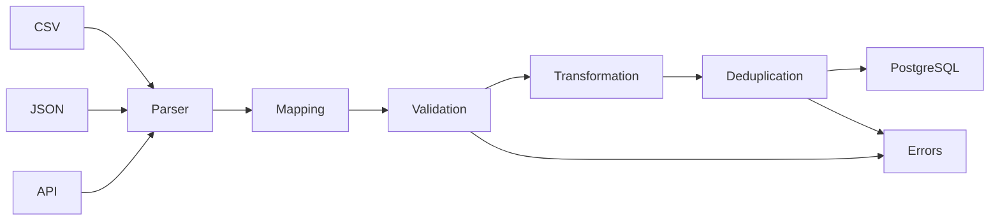

# ETL / Import Engine

Portfolio-ready backend for importing customer and company data from CSV, JSON and external REST APIs into one normalized PostgreSQL model. This is not a file-storage endpoint: every source goes through the same observable, batch-oriented ETL pipeline with per-record validation, transformations, deduplication and an import report.

## What ETL means here

ETL is the process of **extracting** data from heterogeneous sources, **transforming** it into a consistent business representation and **loading** it into a target system. Real exports rarely agree on field names, formatting or quality. This application solves that boundary problem while retaining an audit trail of rejected rows.



In the implementation, safe string normalization is performed before Pydantic validation so values such as `"  JAN@EXAMPLE.COM "` can become `jan@example.com` and then be validated. The preview response makes that order explicit.

## Highlights

- Python 3.12, FastAPI, Pydantic v2 and SQLAlchemy 2 async APIs
- PostgreSQL schema managed by Alembic
- streaming CSV parser; the complete CSV is never loaded into application memory
- configurable commits in batches (`IMPORT_BATCH_SIZE`, default `1000`)
- partial success: one bad business record does not roll back the valid batch records
- dynamic mapping profiles stored as JSON, with no source-specific condition tree
- email, phone, required-field, length, type and date validation
- trim, whitespace collapse, email case folding, phone and company normalization, empty-to-null and date parsing
- duplicate detection by email, external ID or phone with `skip`, `update` and `error` policies
- persistent jobs and row-level errors, filterable history and reports
- CSV dry-run/preview without writing customers or companies
- JSON structured logs and `X-Request-ID` correlation
- external CRM simulator for normal, error, timeout and malformed JSON paths
- isolated automated tests using an async SQLite database

## Architecture

```text
app/
├── api/                 # HTTP routes and FastAPI dependencies
├── core/                # settings, database, errors, logging
├── models/              # SQLAlchemy persistence models
├── parsers/             # source-specific extraction only
├── repositories/        # focused database queries
├── schemas/             # Pydantic API/domain contracts
└── services/            # mapping, transform, validate, dedupe, load, preview
alembic/                 # versioned PostgreSQL schema
mock_api/                # external CRM simulator
scripts/seed.py          # repeat-safe portfolio data seed
examples/                # valid, invalid and duplicate sample inputs
tests/                   # service and end-to-end API tests
```

The source adapters yield a common `dict` record contract. `ImportService` owns orchestration and counters, while focused services own individual ETL decisions. An `ImportJob` is committed before extraction begins, so failed API requests remain visible in history. Valid rows are committed per batch; validation and duplicate errors are inserted in the same batch transaction. A nested transaction protects the batch from a late unique-constraint race during customer insertion.

## Data model

- `customers`: normalized identity and contact data, linked to a company
- `companies`: normalized company identity, name and tax ID
- `mapping_profiles`: source-field to canonical-field maps stored as JSON
- `import_jobs`: source, lifecycle, strategy and processing counters
- `import_errors`: row, field, raw value, code, message and complete raw record

Unique indexed customer keys (`email`, `external_id`, `phone`) support both integrity and deduplication lookups. Import history has compound status/source plus creation-time indexes.

## Run with Docker

Requirements: Docker Engine with Compose v2. No local Python or PostgreSQL is required.

```bash
docker compose up -d --build
docker compose ps
```

Available services:

- API: <http://localhost:8000>
- Swagger UI: <http://localhost:8000/docs>
- health check: <http://localhost:8000/health>
- mock API docs: <http://localhost:9000/docs>
- PostgreSQL: `localhost:5432` (`etl` / `etl` / `etl`)

The API container runs `alembic upgrade head` before Uvicorn starts. To seed demonstration data:

```bash
docker compose exec api python -m scripts.seed
```

Stop containers with `docker compose down`. Add `-v` only when you intentionally want to delete the PostgreSQL volume.

## Local development

Create a PostgreSQL database, then:

```bash
python -m venv .venv
source .venv/bin/activate          # Windows: .venv\Scripts\activate
pip install -e ".[dev]"
cp .env.example .env              # Windows: copy .env.example .env
alembic upgrade head
uvicorn app.main:app --reload
```

For a locally running database, change the host in `DATABASE_URL` from `postgres` to `localhost`.

Create a new migration after a model change:

```bash
alembic revision --autogenerate -m "describe change"
alembic upgrade head
```

## API walkthrough

### 1. Create a mapping profile

```bash
curl -X POST http://localhost:8000/api/mappings \
  -H "Content-Type: application/json" \
  -d '{
    "name": "Legacy CRM customers",
    "mapping": {
      "customer_name": "full_name",
      "mail_address": "email",
      "telephone": "phone",
      "company": "company_name"
    }
  }'
```

Mappings are data, not application branches. They can be managed through:

```text
GET    /api/mappings
POST   /api/mappings
GET    /api/mappings/{id}
PATCH  /api/mappings/{id}
DELETE /api/mappings/{id}
```

Common names such as `name`, `customer_name`, `mail`, `telephone` and `company` also have sensible default aliases when no profile is selected.

### 2. Preview a CSV

Preview maps, transforms and validates up to ten rows but does not run loading or write customers:

```bash
curl -X POST http://localhost:8000/api/imports/preview \
  -F "file=@examples/customers_valid.csv" \
  -F "mapping_profile_id=1" \
  -F "limit=10"
```

```json
{
  "detected_columns": ["customer_name", "email", "phone", "company"],
  "preview": [{
    "raw": {"customer_name": "Jan Kowalski", "email": "jan@example.com"},
    "mapped": {"full_name": "Jan Kowalski", "email": "jan@example.com"},
    "transformed": {"full_name": "Jan Kowalski", "email": "jan@example.com"},
    "validation": {"valid": true, "errors": []}
  }]
}
```

### 3. Import CSV or JSON

```bash
curl -X POST http://localhost:8000/api/imports/csv \
  -F "file=@examples/customers_valid.csv" \
  -F "duplicate_strategy=skip"
```

JSON accepts the record array directly; import options are query parameters:

```bash
curl -X POST "http://localhost:8000/api/imports/json?duplicate_strategy=update" \
  -H "Content-Type: application/json" \
  --data @examples/customers.json
```

An import response is a durable report:

```json
{
  "import_id": 41,
  "status": "completed_with_errors",
  "total": 1000,
  "successful": 972,
  "updated": 10,
  "skipped": 8,
  "failed": 10
}
```

`successful` counts inserts; `updated` is reported independently. A job is `completed_with_errors` when at least one record failed, while valid rows remain committed.

### 4. Import from the mock REST API

First create the legacy mapping shown above, then call:

```bash
curl -X POST http://localhost:8000/api/imports/api \
  -H "Content-Type: application/json" \
  -d '{
    "url": "http://mock-api:9000/mock/customers",
    "mapping_profile_id": 1,
    "duplicate_strategy": "skip"
  }'
```

The adapter handles transport errors, timeouts, non-2xx status codes, malformed JSON and either a top-level array or `{ "items": [...] }`. Mock modes:

```text
http://mock-api:9000/mock/customers?mode=normal
http://mock-api:9000/mock/customers?mode=400
http://mock-api:9000/mock/customers?mode=500
http://mock-api:9000/mock/customers?mode=timeout
http://mock-api:9000/mock/customers?mode=invalid_json
```

### 5. Deduplication policies

For a match on any configured identity key:

- `skip` keeps the existing customer and increments `skipped`;
- `update` updates mutable customer fields and increments `updated`;
- `error` keeps the existing customer and writes a `DUPLICATE_ERROR` row.

Database unique constraints remain the final concurrency-safe guard.

### 6. History, errors and reporting

```text
GET /api/imports?page=1&page_size=20&status=completed&source_type=csv&sort_by=created_at&sort_order=desc
GET /api/imports/{id}
GET /api/imports/{id}/errors?page=1&page_size=20
GET /api/imports/{id}/report
```

Example stored error:

```json
{
  "row_number": 15,
  "field": "email",
  "raw_value": "jan@",
  "error_code": "VALIDATION_ERROR",
  "message": "value is not a valid email address",
  "raw_record": {"customer_name": "Jan", "email": "jan@"}
}
```

Global HTTP errors use a stable envelope:

```json
{
  "error": {
    "code": "IMPORT_FILE_INVALID",
    "message": "Uploaded file is not a valid CSV",
    "details": null
  }
}
```

Other application codes include `IMPORT_SOURCE_ERROR`, `MAPPING_ERROR`, `VALIDATION_ERROR`, `DUPLICATE_ERROR`, `NOT_FOUND` and `INTERNAL_ERROR`. Every response includes an `X-Request-ID`; a caller-provided value is reused and attached to structured logs.

## Tests

```bash
pytest
pytest --cov=app --cov-report=term-missing
```

The suite covers valid and invalid CSV, partial success, JSON and API imports, dynamic mapping, transformations, email and required-field validation, all duplicate policies, reports, history filtering, dry run and multi-batch processing. Tests override FastAPI dependencies with a clean async SQLite database, so they do not require Docker.

## Configuration

All settings can be supplied through `.env` or environment variables:

| Variable | Default | Purpose |
|---|---:|---|
| `DATABASE_URL` | PostgreSQL URL | SQLAlchemy async connection |
| `IMPORT_BATCH_SIZE` | `1000` | records committed per batch |
| `API_REQUEST_TIMEOUT_SECONDS` | `10` | external API timeout |
| `MAX_UPLOAD_SIZE_MB` | `50` | CSV upload limit |
| `LOG_LEVEL` | `INFO` | structured log threshold |

## Design trade-offs

Imports execute in the request process to keep this portfolio project understandable and runnable with three containers. The pipeline and job lifecycle are already separated from HTTP, so moving execution to a durable worker queue is a contained production extension. JSON request bodies and mock API responses are materialized by their protocols; the large-file guarantee specifically applies to CSV extraction. For truly massive datasets, likely next steps are object storage, background workers, PostgreSQL `COPY` staging tables and job cancellation/retry semantics.
